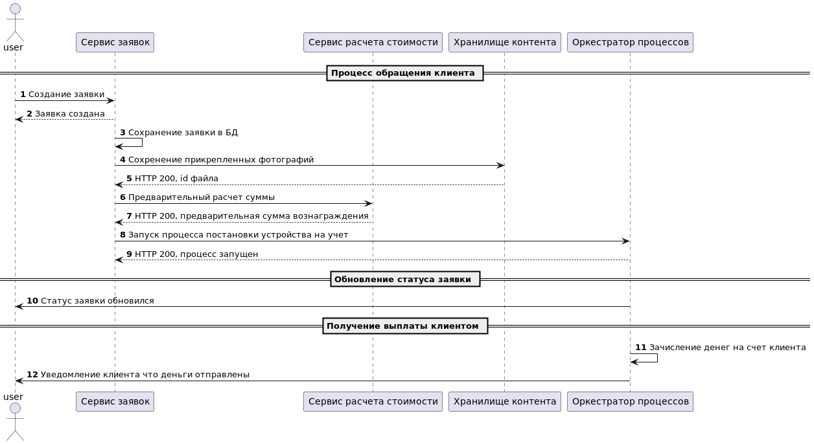
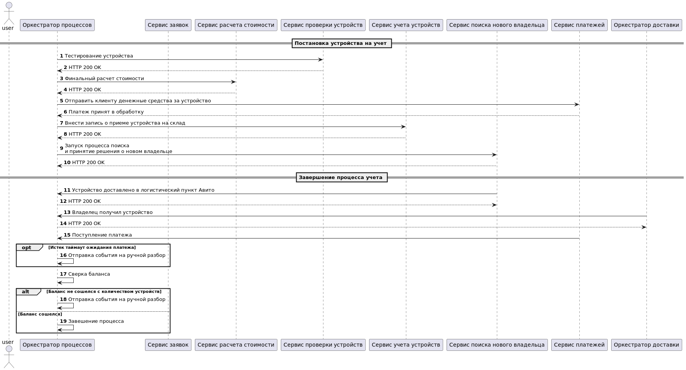
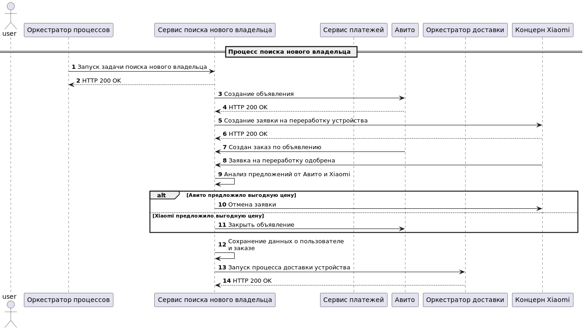
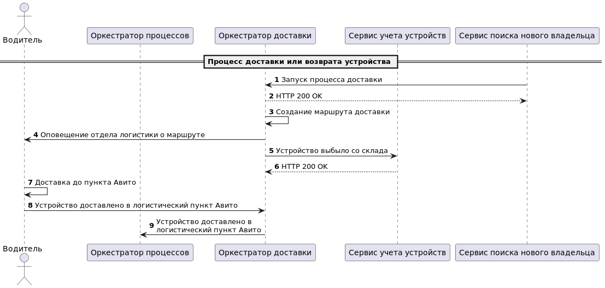

# Задание

Необходимо описать взаимодействие нескольких сервисов и оценить архитектурное решение.

Для критичного сценария:

* Создать диаграмму последовательности (sequence diagram)
* Сделать оценку атрибутов качества (например, надежность, производительность, модифицируемость и т.д) с помощью конкретных сценариев и характеристик ИТ системы.

# Решение
## Сценарий 1. Обращение клиента

**Масштабируемость**. Оценка 4/5, т.к. все сервисы кроме Хранилища контента легко скалируются в среде виртулизации. Можно настроить autoscaling для автоматического масштабирования. В качестве хранилища контента можно выбрать масштабируемую файловую СУБД типа S3.\
**Производительность**. Оценка будет зависеть от качества кода Сервиса заявок. В архитектурном смысле нет блокеров чтобы сделать хороший производительный сервис.
Сервис расчет стоимости за счет его Stateless природы можно сделать очень производительным. Хранилище контента здесь может стать бутылочным горлышком, но проблема может решаться на уровне СУБД, либо переходом на асинхронное сохранение файлов.\
**Надежность**. Оценка 3/5. В случае отказа Сервиса заявок или Оркестратора процессов, процесс должен быть завершен с ошибкой.\
**Модифицируемость**. Оценка 5/5 за счет микросервисной архитектуры и подхода с оркестратором.\

## Сценарий 2. Учет устройств на складе

**Масштабируемость**. Оценка 5/5 за счет Stateless подхода. Оркестратор процессов тоже хорошо масштабируется, если выбирать по от основных вендоров таких как Camunda.\
**Производительность**. Оценка будет зависеть от качества кода микросервисов. В архитектурном смысле нет блокеров чтобы сделать хороший производительный сервис.\
**Надежность**. Оценка 4/5. Почти все сервисы, входящие в автоматизацию данного сценария являются Stateless, поэтому при отказе одного из ЦОД, система продолжит работать, но с меньшей производительностью.\
**Модифицируемость**. Оценка 5/5 за счет микросервисной архитектуры и распределенных саг, а также представлений в виде бизнес-процессов.\

# Сценарий 3. Поиск нового владельца

**Масштабируемость**. Оценка 5/5 за счет микросервисного и Stateless подхода.\
**Производительность**. Оценка 3/5 за счет жесткой зависимости от внешних систем таких как API Авито и API платежного шлюза.\
**Надежность**. Оценка 3/5. Процесс может упасть по вине внешнего платежного шлюза. Если падение API Авито можно пережить и перевести процесс в состояние ожидания, то неработющий платежный шлюз оказывает огромное значение на пользовательский опыт и успешное завершение процесса.\
**Модифицируемость**. Оценка 5/5 за счет микросервисной архитектуры и распределенных саг, а также представлений в виде бизнес-процессов.\

# Сценарий 4. Доставка устройства

**Масштабируемость**. Оценка 5/5 за счет микросервисного и Stateless подхода.\
**Производительность**. Оценка будет зависеть от качества кода микросервисов. В архитектурном смысле нет блокеров чтобы сделать хороший производительный сервис.\
**Надежность**. Оценка 5/5. Все сервисы, входящие в автоматизацию данного сценария являются Stateless, поэтому при отказе одного из ЦОД, система продолжит работать, но с меньшей производительностью.\
**Модифицируемость**. Оценка 5/5 за счет микросервисной архитектуры и распределенных саг, а также представлений в виде бизнес-процессов.\